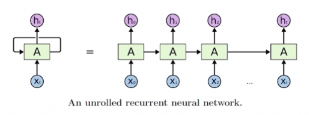

# 강의 요약

## 4강. 얕은 신경망 네트워크

### (1) 신경망 네트워크 개요

- 로지스틱 회귀  : w,b를 이용해서 a를 구한다
- node는 a와 a에 activate function을 적용한 z를 구한다.
- 대괄호 위첨자 : layer number
- 소괄호 위첨자 : sample number
- 도함수 계산을 위해 역방향 계산을 통해 da, dz를 계산한다. → 신경망에서도 chain rule을 이용해 도함수를 구한다.
- 다중 로지스틱 회귀라고 생각하면 이해에 도움이 된다.

---

### (2) 신경망 네트워크 구성 알아보기

- single hidden layer neural network
    
    
    
    - input layer
    - hidden layer : 실제 값은 training set에 기록되지 않는다.
    - output layer
    - 지도 학습에선 sample이 입력 X, 결과 Y로 구분되어 있다.
    - 입력층 = X = a^[0]
    - 은닉층 = a^[1] / w^[1], b^[1]의 변수에 의존한다
    - 출력층 = a^[2] / w^[1], b^[1]에 관련되어 있다.
        
        → 입력층은 counting X : 2 layer NN
        

---

### (3) 신경망 네트워크 출력의 계산

- 로지스틱 회귀와 비슷하지만 여러번 반복된다.
- 각 노드에 대해 w,b값을 이용한 z로부터 a값을 계산한다. 이 a 값이 다음 노드의 input값이 된다.
    
    
    
    → 이를 행렬로 표현하면 w의 열벡터 W, x의 열벡터 X, b의 열벡터를 이용해서 a의 열벡터를 표현할 수 있다
    
    ## dot(W.T, X) + b = a
    

---

### (4) 많은 샘플에 대한 벡터화

- 다수의 샘플에 대한 벡터화를 통해 한 번에 동시에 계산
    
    
    
    → 한 훈련 sample에 대한 pred_y값을 계산하는 네 줄의 코드
    
    a^[i](j) : i는 몇 번째 layer인지 의미, j는 몇 번째 sample인지 의미
    
    - 위 네 줄의 코드 위에 for i=1 to m으로 추가하는 원리, 그러나 for문 사용을 피하기 위해 이에 대해 vetorization을 진행
    - vetorization을 진행한 후의 행렬에서 열은 sample number를 의미하고, 행은 hidden layer 내의 node(unit) number를 의미한다

---

### (5) 벡터화 구현에 대한 설명

---

### (6) 활성화 함수

- 다양한 활성화 함수들
    - 도함수(함수의 기울기)가 0에 가까워지면 w,b에 대한 학습이 제대로 이루어지지 않는다. (학습 속도 역시 느려짐)
    
    
    
    - Sigmoid
        
        
        
        - 0부터 1까지 나타낸다
        - 이진분류의 출력층에서 주로 사용하는 활성화 함수. 그 외에는 잘 사용되지 않는다.
    - Tanh
        
        
        
        - -1~+1까지의 값을 나타낸다. → 데이터의 평균이 0주변으로 형성되어 다음 학습에 용이함 (단, output은 이진분류일 때 sigmoid가 더 유리하다)
        - sigmoid와 비슷하지만 원점을 지나고, 그 성능이 더 좋다
    - ReLU
        
        
        
        - 일반적으로 많이 사용된다.
        - 그러나 z가 음수일 경우에는 기울기가 0 → 이 단점을 보완하기위해 leaky ReLU가 등장
        - 대부분의 기울기가 0에 대해 매우 다르기 때문에 신경망이 더 빠르게 학습될 수 있다.
    - leakyReLU
        
        
        

---

### (7) 왜 비선형 활성화 함수를 써야할까요?

- g(z)에서 g를 선형함수로 가정했을 때 z에 대한 업데이트가 일어나지 않는다.
- 선형 활성화 함수로 가정하거나, 활성화 함수가 없다면 여러 층의 hidden layer를 가짐에도 불구하고 활성화 함수만 계산해서 hidden layer가 없는 것처럼 계산된다. logistic regression과 다를 것이 없어진다.

---

### (8) 활성화 함수의 미분

- 신경망의 역전파를 구현하려면 활성화 함수의 도함수를 구해야 한다.
    
    
    
- 활성화 함수를 g(z)라고 가정할 때
    - sigmoid : g’(z) = g(z)(1-g(z))
    - Tanh : g’(z) = 1-(g(z))^2
    - ReLU
        - z<0 : g’(z) = 0
        - z≥0 : g’(z) = 1
    - Leaky ReLU
        - z<0 : g’(z) = 0.01
        - z≥0 : g’(z) = 1

---

### (9) 신경망 네트워크와 경사 하강법

- 1 hidden layer를 가진 neural network에서의 경사하강법을 진행
- 이진 분류를 한다고 가정했을 때 cost function J는 m개의 sample에 대한 Loss function의 함숫값의 평균값과 같다.
- 아래 식들의 도함수를 구하기 위해 여러가지 식을 이용한다.( 다음 강의에서 추가 설명 )
- hidden layer가 여러개일 경우 아래 식을 1~m까지 반복하면 서서히 수렴한다.

---

### (10) 역전파에대한 이해 (pass)

- 계산 그래프를 통한 역전파 식의 이해
- 차원이 일치하는지 확인하고 연산하는 과정이 중요

---

### (11) 랜덤 초기화

- 신경망의 가중치를 초기화하는 방법 (임의의 값으로 초기화하는 방법)
- 만약 초기값을 0으로 지정한다면, 노드별로 같은 값을 갖게된다. 두 hidden unit이 같은 함수를 이용하므로 출력 유닛에 같은 영향을 주어 계속 대칭적으로 update를 진행하며 훈련 횟수와 상관없이 항상 같은 값을 가진다. → 두 개의 hidden unit을 지정하는 의미가 없다.
- 따라서, 위와 같은 문제를 방지하기위해 변수를 랜덤한 값으로 설정한다
    
    ex. w^[i] = np.random.rand((2,2))*0.01 → 2by2크기의 랜덤한 행렬 설정, 작은 값을 갖기 위해 0.01을 곱해준다.
    
    이 때 w를 이미 비대칭적이게 초기화했으므로 b는 0으로 초기화해도 상관없다.
    
- 가중치를 초기화할 때 매우 작은 값으로 정하는 것이 좋은데, 활성화함수가 너무 큰 입력값을 갖게되면 기울기가 작은 부분의 결과를 갖기 때문에 경사하강법이 매우 느리게 일어나서 학습의 속도가 느려진다.
    
    → 특히 이진분류의 경우에는 tanh, ReLU가 아닌 sigmoid를 사용하므로 특히 큰 값으로 초기화하지 않기 위해 주의해야한다.